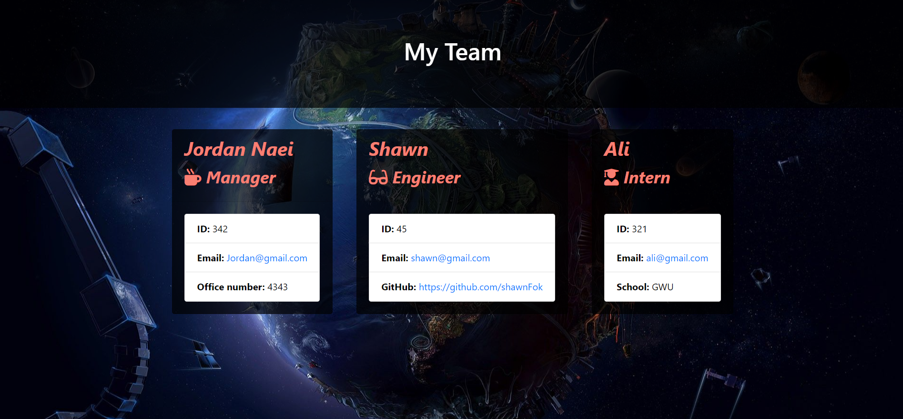

# Template Engine - Employee Summary Application

# Description
This is a command line application. The application will prompt the user for information about the team manager and then information about the rest of the team members. The user can input any number of team members, and they may be a mix of engineers and interns. 

This application provides a preliminary validations on the User delivered answers, which can be further enhanced/tailored based on the usage case, so to ensure refactoring needs we kept the validation at a very high level.

# Application Functionalities illustration video

[Video Link](https://drive.google.com/file/d/1Vx8YMpshH6HI9JQmLzVTENSoJ4v4QMiA/view)

# Application Generated HTML Page Sample

# Application added to Profile

# Installation
1- Ensure initilazing the application with nmp i, to include all dependent modules included in the package.json file.
2- Run npm test to validate the success of all unit test cases.

# Usage
1- Upon initializing the client will be prompt with questions pertianing the team manage.
2- Then, will be prompt with a question with regards the next team member occupation (Engineer or Intern).
3- Answering all questions accurately will ensure an accurate html representation for your team.

# Repository

- [Project Repo](https://github.com/JordanNaei/teamProfileGenerator)